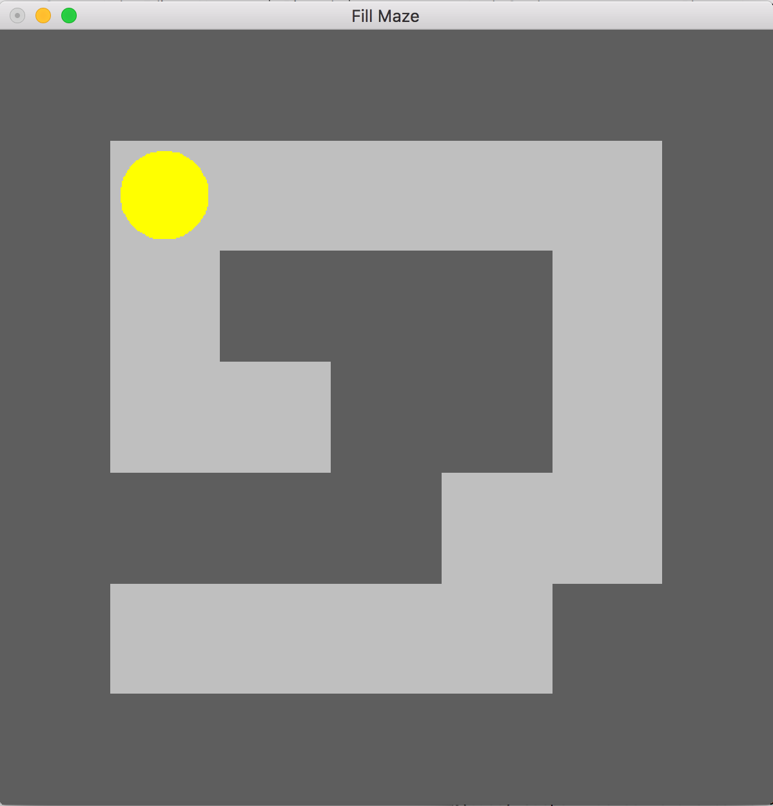

# Fill-Maze
## 1. Introduction
This is a simple Fill-Maze game based on OpenGL C++. The scenario is that you have to control a yellow ball moving with the keyboard, and the area that the ball passed through will be filled in another color. Until all movable area in this maze is fully filled, then the game is finished.

So the goal of this project is to teach you to set up an OpenGL environment on macOS and learn about OpenGL with a simple game.

## 2. Prerequisite
### 2.1 Environment
* System: macOS 10.13
* IDE: CLion
* Tools: C++, glut, (optional: glfw, glew, glm)

### 2.2 Installation
For macOS, glut is already installed, so you don't have to install it again. And for this project, only glut is required.

But glut is outdated as an OpenGL tool and no longer officially supported, now the combination of OpenGL tools, glfw & glew, is more popular. You can install them by Homebrew, if you are interested.

To install brew, in case you don't have it:

    /bin/bash -c "$(curl -fsSL https://raw.githubusercontent.com/Homebrew/install/HEAD/install.sh)"

To install those tools by Homebrew:

    brew install glfw 
    brew install glew
    brew install glm

Don't forget set up your CMakeLists.txt file with your tool version, just like the .txt file in this project.

## 3. Usage
You can play this game by simply running the executable file by commands:

    cd cmake-build-debug/
    ./Launch 

Or you also can open this whole project with CLion and run it.